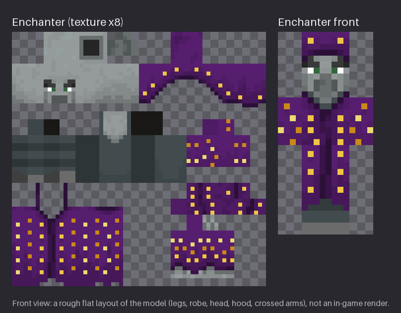

# Minecraft Packs

[](https://github.com/JudoChinX/minecraft-packs/actions/workflows/ci.yml)
[](https://github.com/JudoChinX/minecraft-packs/releases)
[](https://opensource.org/licenses/MIT)
[](https://www.python.org/downloads/)
[](https://www.minecraft.net/)
[](https://github.com/astral-sh/ruff)
[](https://github.com/pylint-dev/pylint)
[](https://mypy-lang.org)
[](https://github.com/adrienverge/yamllint)
[](https://github.com/PyCQA/bandit)
[](https://pytest.org)
[](#key-features)
[](https://github.com/sponsors/JudoChinX)

<p align="center">
  
</p>

**Minecraft Packs** builds Minecraft Java resource packs reproducibly, and is the home of the packs for a small private [Paper](https://papermc.io/) server. Each pack is a short, declarative `pack.toml`. The build downloads Mojang's official client jar, verifies it, recolours the textures the pack names, and writes a deterministic zip whose SHA-1 a server can pin. The repository contains no Mojang files; `docs/enchanter-preview.png` is a render of the pack's derived art.

## Packs

| Pack | What it does | Minecraft | Download |
|---|---|---|---|
| [`enchanter`](packs/enchanter/) | Recolours the Illusioner into a purple-robed, gold-trimmed Enchanter in the style of Minecraft Dungeons. | Java 26.3 (pack format 97) | [Latest release](https://github.com/JudoChinX/minecraft-packs/releases/latest) |
| [`mobs`](packs/mobs/) | Every custom mob look in one pack: the Sift mobs (Blob, Sifter, Harmonizer, Twisted Harmonizer), the eight soul-corrupted mobs, the Sculk Sniffer, the Jellyfish, the Tropical Fish Slime, the Tuff Golem, the Bear, the Piston Golem, the Summoner, a 3D Enchanter, the Arch-Illager boss (in its poncho and pauldrons, with two crossbows and a netherite sword) and the Hopping Pig as BetterModel display models, and their items, the Orb of Dominance and the Ancient Callings book among them. The Summoner, the Enchanter and the Arch-Illager wear the vanilla illager face, and the Hopping Pig the vanilla pig texture, through an atlas file that names the client's own textures, so no Mojang pixels ship. It no longer recolours the Illusioner; that is the `enchanter` pack. | Java 26.3 (pack format 97) | [Latest release](https://github.com/JudoChinX/minecraft-packs/releases/latest) |
| [`sift`](packs/sift/) | **Data pack.** Adds a dimension in the style of the Sift from Minecraft Dungeons II: Singer's Meadow and the Carapace, on vanilla terrain shapes. No client install. | Java 26.3 (data pack format 121) | [Latest release](https://github.com/JudoChinX/minecraft-packs/releases/latest) |

### `enchanter`

On the server this pack was made for, the Enchanter is a plugin-spawned Illusioner. The pack retextures every Illusioner, and since vanilla Illusioners never spawn naturally, nothing else a player sees changes. Every change is a hue-range rule applied to the vanilla texture's palette, keeping each colour's shading and transparency: the saturated blue robe becomes deep purple, and the pale-blue, teal and blue-violet speckles become three tones of gold. The illager's skin, eyes and grey shirt are untouched, and nothing is hand-painted. The preview above is generated by the build itself (`python -m minecraft_packs preview enchanter docs/enchanter-preview.png`).

## Key Features

- **No Mojang Files in the Repository:** The build fetches the official client jar at build time into a git-ignored cache. The repository holds rules, not textures; its one image derived from Mojang's art, `docs/enchanter-preview.png`, is a render of the pack's derived art.
- **Verified Sources:** The client jar must match the SHA-1 Mojang's own version manifest lists *and* the SHA-1 the pack pins; every texture read from it must match a pinned SHA-256. If Mojang changes a texture, the build stops instead of shipping an unreviewed recolour.
- **Reproducible Zips:** Sorted, uncompressed entries with fixed timestamps and modes, so the zip's bytes do not depend on the zlib build. The same inputs give a byte-identical zip and the same SHA-1; each pack commits its expected SHA-1, and CI builds every pack twice and fails unless both builds match it.
- **Server-Ready Releases:** Tagging a version publishes `<pack>-<version>.zip` and its `.sha1` as GitHub Release assets, ready for a server's `resource-pack` and `resource-pack-sha1` settings.
- **Declarative Packs:** A pack is a `pack.toml` of recolour rules plus an optional `files/` directory copied in verbatim. Unknown keys are rejected, not ignored, so a typo cannot silently change a pack.
- **Review Previews:** One command renders a pack's recoloured texture beside a flat front view of the model, so a rule change can be judged before it ships. Previews draw only the pack's derived texture, never the vanilla one.
- **Offline Verification:** `verify` checks a built zip's layout, `pack.mcmeta`, icon, images and `.sha1` sidecar without the network or Mojang's assets.
- **No Telemetry:** The build talks to Mojang's download servers and nothing else. See [SECURITY.md](SECURITY.md).

## Why Minecraft Packs?

A server pins the resource pack it sends by SHA-1, so a pack is only as useful as its build is repeatable: a rebuild that changes one byte breaks every server pointing at it. Hand-edited PNGs committed to a repository cannot be re-derived when Mojang updates a texture, cannot show why a colour is what it is, and redistribute Mojang's art. Here a pack is a handful of rules applied to a verified official texture. The output is small, reviewable and byte-for-byte reproducible, and the repository stays free of anything it has no right to publish.

## Quick Start

For a server admin, a pack is two values: the release asset's URL, and its SHA-1. The SHA-1 is published beside every zip, and is the same value committed in [`packs/enchanter/expected.sha1`](packs/enchanter/expected.sha1):

```bash
curl -fsSL https://github.com/JudoChinX/minecraft-packs/releases/download/v0.1.0/enchanter-0.1.0.zip.sha1
```

With the [`itzg/minecraft-server`](https://github.com/itzg/docker-minecraft-server) image:

```yaml
services:
  minecraft:
    image: itzg/minecraft-server
    environment:
      EULA: "TRUE"
      TYPE: PAPER
      RESOURCE_PACK: "https://github.com/JudoChinX/minecraft-packs/releases/download/v0.1.0/enchanter-0.1.0.zip"
      RESOURCE_PACK_SHA1: "<the 40-character SHA-1 from enchanter-0.1.0.zip.sha1>"
      RESOURCE_PACK_PROMPT: '{"text":"This server recolours the Illusioner as the Enchanter."}'
      RESOURCE_PACK_ENFORCE: "TRUE"
```

Or directly in `server.properties`:

```properties
resource-pack=https://github.com/JudoChinX/minecraft-packs/releases/download/v0.1.0/enchanter-0.1.0.zip
resource-pack-sha1=<the 40-character SHA-1 from enchanter-0.1.0.zip.sha1>
resource-pack-prompt={"text":"This server recolours the Illusioner as the Enchanter."}
require-resource-pack=true
```

- **Pin a version, never `latest`.** The SHA-1 identifies one exact zip; point the URL and the SHA-1 at the same release and update both together.
- **Enforcement disconnects players who decline.** `RESOURCE_PACK_ENFORCE` / `require-resource-pack` makes the pack mandatory; set it to `FALSE` / `false` to offer the pack without requiring it.
- **A server sends one pack.** To combine several packs, merge them into one zip first, or use a plugin that serves several.

### Installing a data pack

A data pack such as `sift` is not sent to clients. It goes in the server's primary world's `datapacks/` folder, followed by a full restart (`/reload` does not reload worldgen). With `itzg/minecraft-server`:

```yaml
      DATAPACKS: "https://github.com/JudoChinX/minecraft-packs/releases/download/v0.2.0/sift-0.2.0.zip"
```

A worldgen data pack is one-way: once its dimension has generated, removing the pack breaks that world. See [`packs/sift/README.md`](packs/sift/README.md).

## Building Locally

Requires Python 3.13+. The build downloads the Minecraft client jar (about 40 MB) once into `.cache/`.

```bash
python -m venv .venv && source .venv/bin/activate
pip install -r requirements.txt

python -m minecraft_packs build                                 # every pack -> dist/<pack>-<version>.zip + .sha1
python -m minecraft_packs build enchanter                       # one pack
python -m minecraft_packs build --check                         # fail unless each zip matches packs/<pack>/expected.sha1
python -m minecraft_packs preview enchanter preview.png         # texture + front-view review sheet
python -m minecraft_packs verify dist/enchanter-0.1.0.zip       # offline structural check + .sha1
```

`build` prints each zip's path and a `RESOURCE_PACK_SHA1=<sha1>` line, and compares it with the SHA-1 committed in `packs/<pack>/expected.sha1`: a mismatch is a warning, or an error under `--check`. After an intended change, rebuild with `--update-expected` and commit the new pin. Already have the client jar? Pass `--client-jar path/to/client.jar`; it is still checked against the pinned SHA-1.

**Without installing Python**, run the same commands in a container:

```bash
docker run --rm --user "$(id -u):$(id -g)" -e HOME=/tmp -v "$PWD:/repo" -w /repo python:3.13-slim \
  sh -c 'pip install -q --user -r requirements.txt && python -m minecraft_packs build'
```

**Reproducibility depends on the encoder.** Pillow is pinned exactly in `requirements.txt` because PNG bytes, and therefore the zip's SHA-1, depend on it. Build with the pinned version; CI installs it from `requirements-hashes.txt` with `--require-hashes`.

## Adding a Pack

Create `packs/<name>/pack.toml`. The [enchanter's definition](packs/enchanter/pack.toml) is the worked example, and the [pack definition reference](docs/pack-definition.md) documents every key. Render a preview, review it, then build:

```bash
python -m minecraft_packs preview <name> preview.png
python -m minecraft_packs build <name>
```

## Documentation

- **[Pack Definition Reference](docs/pack-definition.md)** — Every `pack.toml` key, the rule semantics, static files, and `expected.sha1`.
- **[Style Guide](docs/style-guide.md)** — Code and test conventions for contributors.
- **[Security & Trust](SECURITY.md)** — What the build downloads, how it verifies it, and how to report a vulnerability.
- **[Contributing](CONTRIBUTING.md)** — How to help, and the checks every change must pass.
- **[Roadmap](ROADMAP.md)** — Planned packs and features.
- **[Release Runbook](docs/runbook-release.md)** — How a version is tagged and published.
- **[Changelog](CHANGELOG.md)** — What changed in each release.

## Not Affiliated with Mojang

NOT AN OFFICIAL MINECRAFT PRODUCT. NOT APPROVED BY OR ASSOCIATED WITH MOJANG OR MICROSOFT.

Minecraft and its textures are the property of Mojang AB. This repository contains no Mojang files: the packs' textures are derivative recolours, generated at build time from the official assets Mojang publishes, and `docs/enchanter-preview.png` is a render of the pack's derived art. Both are made available under the [Minecraft Usage Guidelines](https://www.minecraft.net/en-us/usage-guidelines).

## Development Transparency

This project is developed with AI assistance: much of its code and documentation was written with AI coding tools. Its correctness rests on automated verification rather than on a claim of line-by-line human review — every change must pass the linters, type checker, security scan and a test suite held at 95% coverage (currently 100%), and CI builds every pack twice and fails unless the results are byte-identical.

## License

The code and documentation in this repository are MIT licensed — see [LICENSE](LICENSE). The MIT grant does not cover the pack art: the textures the build produces and the preview image in `docs/` are derived from Mojang's assets, and their use is governed by Mojang's [Minecraft Usage Guidelines](https://www.minecraft.net/en-us/usage-guidelines) and EULA. See [NOTICE](NOTICE).
